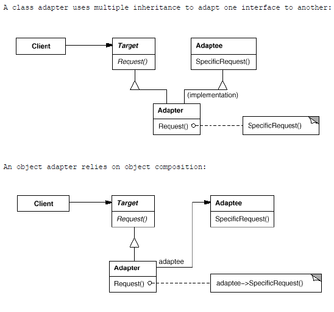

# Adapter

## Type: Structural Pattern

### Structure:

### In my Codes(Role - Classes):
- Target: `Shape`
- Adapter: `TextShape`
- Adaptee: `TextView`

### Key Points
- If we want to reuse a class but that is not compatible to one
interface, we can create another class called `Adapter` to 
make the incompatible class compatible.
- There are 2 ways to make it. 
  1. Dependency - the adapter has a pointer of adaptee, just like
  the example of my project
  2. Inheritance - this can be done in the languages that support 
  multiple inheritance like C++, Python etc.. We can just apply it 
  like the code below:
  
  `class Adapter : public Target, private Adaptee {...}`
- In Java, we can just apply only one adapter to the adaptee, 
 and the target must be an abstract class / interface.
  
### Key Word
- Wrapper

