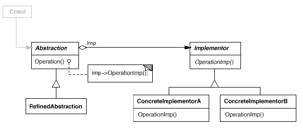

# Bridge

## Type: Structural Pattern

### Structure:

### In my Codes(Role - Classes):
- Abstraction: `Shape`
- Refined Abstraction: `Circle`
- Implementor: `ShapeImp`
- ConcreteImplementor: `CircleImp`, `GreenCircleImp`

### Another Name
- Handle
- Body

### Key Points
- Abstraction has a pointer to its own implementation 
- Bridge pattern decouples the interface and the implementation
- We can extent abstraction & implementation hierarchy independently
- Implementation is hidden from client
- To create correct implementor, we can create a factory to deal with it
(Using **Abstract Factory** or **Factory Method**, and it makes that 
 any abstractions do not couple with any implementor classes)
- Implementor can be singleton shared with other abstractions (Using **Singleton**)

### Example

In hadoop 2.8, the `Context` classes and their implementations such as

- `MapContext` & `MapContextImpl` 
- `ReduceContext` & `ReduceContextImpl`

use Bridge Pattern.