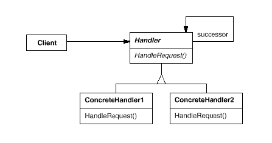
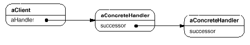

# Chain of Responsibility

## Type: Behavioral Pattern

### Structure:

### In my Codes(Role - Classes):
- Handler: `Logger`
- ConcreteHandler: `FileLogger`, `ConsoleLogger`, `ErrorLogger`

### Key Point
- In that mode, there are multiple objects that are able to handle one request, 
 and what object(s) handle is determined in run-time.
- A handler should judge whether the request should be dealt
- A handler has a pointer/reference to next handler (successor). A handler should 
 pass the request to the next handler no matter it should deal with the request 
 or not
#### Structure of a Typical Chain of Responsibility 
