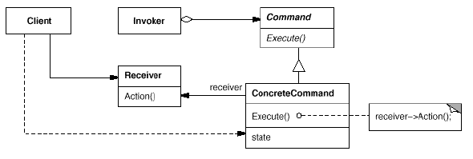
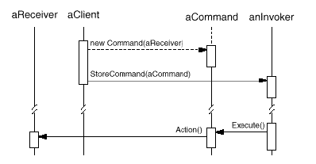

# Command

## Type: Behavioral Pattern

### Structure:

### In my Codes(Role - Classes):
- Command: `Command`
- ConcreteCommand: `OpenCommand`, `PasteCommand`, `MacroCommand`
- Invoker: `Client` / `Main`
- Receiver:
    - In `OpenCommand`: `Application`
    - In `PasteCommand`: `Document`

### Key Point
- A **command** stores **receivers**, and an **invoker** stores **commands**.
 In this program, the invoker is just the `Main` class, the commands are automatically
  stored when the program is executing.
- `MacroCommand` stores many commands, which is like a composite command
- It is easy to create a command, no need to modify existed classes
- The order to create & execute a command
    1. Client creates a new command with a receiver
    2. Invoker stores the command
    3. Invoker executes the command and the command starts to manipulate the 
        receiver
#### Diagram
