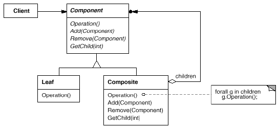
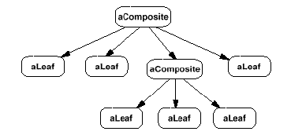

# Composite

## Type: Structural Pattern

### Structure:

### In my Codes(Role - Classes):
- Component: `Equipment` - Abstract class
- Leaf: `Bus`, `Cabinet`, `Chassis`, `FloppyDisk`
- Composite: `CompositeEquipment`

### Key Points
- We should create a common interface for all components, including composite component
- A composite component should manage a collection of components, which can be a leaf or
 a composite component, and a composite component should call the implementation of 
 sub-components, which is defined in the interface
- The structure of a (composite) component is like a tree, we can add sub-components recursively

#### The Diagram of a Component
