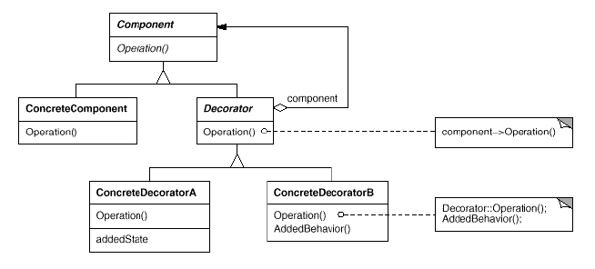

# Decorator

## Type: Structural Pattern

### Structure:

### In my Codes(Role - Classes):
- Component: `Component` - Abstract Component
- Decorator: `Decorator` - Abstract Decorator with a component being decorated
- ConcreteComponent: `TextView`
- ConcreteDecorator: `BoarderDecorator`, `ScrollBarDecorator`

### Key Points
#### Diagram:

- Define a series of methods to unify the interface of decorator & component,
  that is, decorator & component are the same thing.
- Each decorator contains a component as a field that is being decorated
- We can add some other operations to decorate the component dynamically, without 
  knowing what the component is, then execute the operations of the inner component
- To decorate a component, just do it recursively like the diagram above, or like the 
  code below:  
<pre>
Component decoratedComponent = 
    new Decorator_1( 
        new Decorator_2(.... 
            new Decorator_n(new ConcreteComponent(..))
        )
    ); //Recursively Decorate
</pre>
The order to decorate the component is `n -> n-1 -> ... -> 1`
 
### Comparing with Python Decorator
#### Example:
<pre>
def decorator(text=""):
    def outer_wrapper(func):
        print(123)
        @functools.wraps(func)
        def wrapper(*args, **kwargs):
            print(text)
            print('begin')
            # if add (), then func is executed
            rst = func(*args, **kwargs)  # Real function
            print('end')
            return rst
        print(321) # Execute before wrapper
        return wrapper
    return outer_wrapper

# @decorator()
def test():
    print('test')
test = decorator()(test) # 1
test() # 2
</pre>
#### Description
From the code above, the function `test` is decorated by
`wrapper` & `outer_wrapper`.
First in #1, `decorator` returns `outer_wrapper`, then `outer_wrapper`
 executes and returns the `wrapper`. Finally, the `test` is valued
 as `wrapper`.
In #2, `wrapper` is executed and the original `test` is kept because of
the **function closure**.
#### Conclusion
Thus, the order to decorate the component is the **opposite** of 
that of OO-decorator. We decorate the outer first then the inner.

