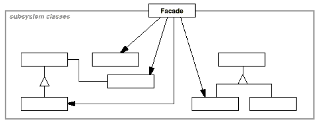

# Facade

## Type: Structural Pattern

### Structure:

### In my Codes(Role - Classes):
- Facade: `ShapeMaker`
- Subsystem Classes: `Shape`, `Circle`, etc..

### Key Points
- Facade should know which subsystem classes are responsible
 for a request
- Facade delegates client requests to appropriate subsystem 
  objects
- Subsystem classes implement subsystem functionally, handle 
  works assigned by the facade
- Subsystem classes have no knowledge og the facade