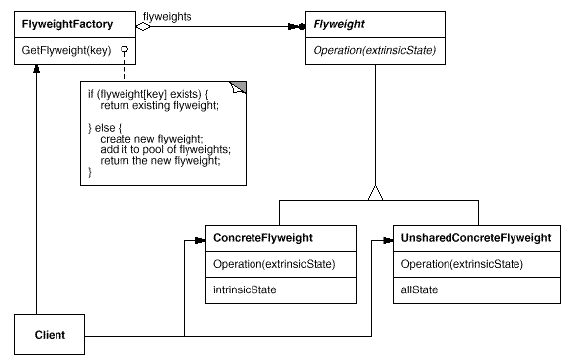
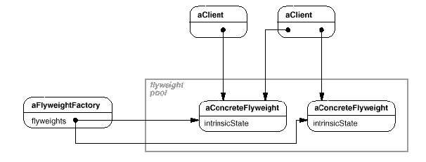

# Flyweight

## Type: Structural Pattern

### Structure:

### In my Codes(Role - Classes):
- Flyweight: `Shape`
- FlyweightFactory: `ShapeFactory`
- ConcreteFlyweight: `Circle`
- UnsharedConcreteFlyweight: `CircleComposite`

### Key Points
#### Diagram

- A flyweight factory manages a flyweight pool, intrinsic states are stored
 in flyweights, outer states are stored/calculated in the client/unshared
  flyweight, and are transferred to flyweights when doing some operations
- Users should instantiate flyweights only by flyweight factory 
- Concrete flyweights should be sharable, intrinsic states stored in flyweights,
  which are independent of flyweights' object's context
- Unshared flyweights are not forced to be sharable, but often they use concrete
 sharable flyweights as their children at some level, that is, flyweight mode is 
 often used with composite mode
- Flyweight mode can help to save memory, but make the entire system complicated