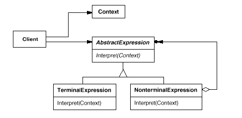

# Interpreter

## Type: Behavioral Pattern

### Structure:

### In my Codes(Role - Classes):
- Context: `HashMap<String, Integer>`
- AbstractExpression: `Expression`
- TerminalExpression: `VarExpression`
- NonterminalExpression: `SymbolExpression` and its subclasses

### Key Point
- If we want to interpret a language and a grammar tree can be built, this mode
 is capable and suitable
- In a grammar tree, the terminal expression is the leaf, the non-terminal expression 
 is the non-leaf node, which contains child nodes(terminal or non-terminal). We may 
 interpret it recursively for non-terminal till terminal nodes
- Context contains information that's global to the interpreter, which is usually a
 map(K-V). In the program, the context is `HashMap<Variable, Value>`
- We can use flyweight mode to share the terminal expression

