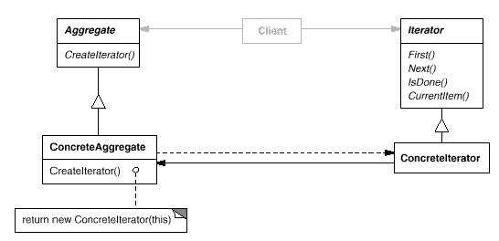

# Iterator

## Type: Behavioral Pattern

### Structure:

### In my Codes(Role - Classes):
- Aggregate: `List`
- ConcreteAggregate: `LinkedList`
- Iterator: `Iterator`
- ConcreteIterator: `LinkedListIterator`

### Key Point
- Iterator provides an interface to access the elements
of the collections using different methods, without exposing
internal structures
- Iterator simplifies the interface used to traverse the collection
- Iterator makes a collection with multiple traversals
