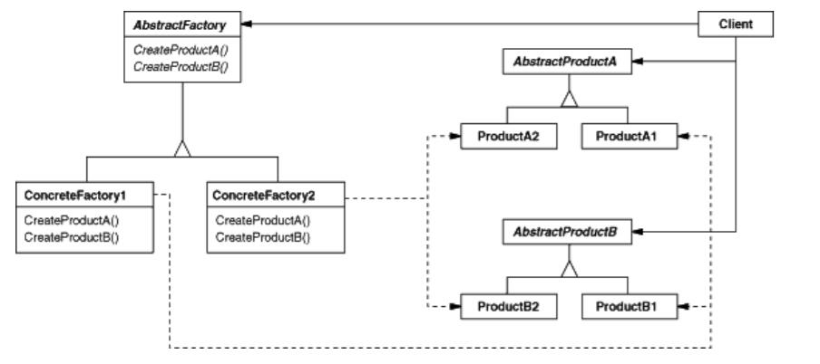

# Abstract Factory

## Type: Creational Pattern

### Structure:

### In my Codes(Role - Classes):
- AbstractFactory: `MazeFactory`
- ConcreteFactory: `EnchantedMazeFactory`
- AbstractProduct: `MazeSite`
- ConcreteProduct: `Door`, `Room`, `Wall`, `EnchantedDoor`, `EnchantedRoom`
- Client: `MazeGame`

`AbstractFactory` defines a series of functions to create products,
and `ConcreteFactories` just override them.

To create series products, use this pattern is feasible. 

### Way to Create Products

`AbstractFactory factory = new ConcreateFactory();`

`client.createProduct(factory);`

In method `createProduct`: `factory.createProductXX();`
