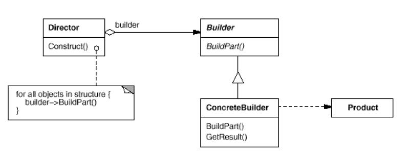

# Builder

## Type: Creational Pattern

### Structure:

### In my Codes(Role - Classes):
- Director: `MazeGame`
- Builder: `MazeBuilder`
- ConcreteBuilder: `StandardMazeBuilder`, `CountingMazeBuilder`

`Director` defines a functions to create products, and it should
be initialized by a `ConcreteBuilder`. But the build task is done in
`concreteBuilder.buildPart()`. And it is necessary to have a function
to return the product to the director in `Builder`

To create a whole product part by part, use this pattern is feasible. 
