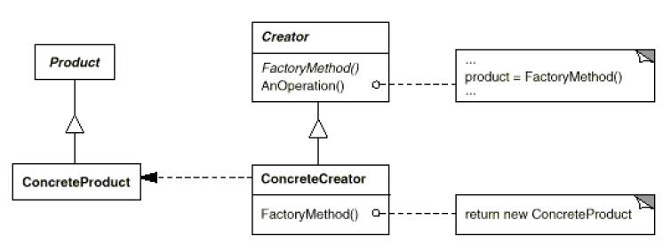

# Factory Method

## Type: Creational Pattern

### Structure:

### In my Codes(Role - Classes):
- Creator: `MazeGame`
- ConcreteCreator: `EnchantedMazeGame`
- Product: `Wall`, `Room` etc..

### Key Point
- Factory Method is just the same as **Virtual Constructor**.
Just define the method(s) in base class as virtual method and let
derived class to override it/them
- We can use Template/Generic to avoid creating too many derived classes.

Like that: 

<pre>class Creator<T>
{
         
         <T> T makeT(Class<T> cls)
         {
             T obj = null;
             try 
             {
                 obj = cls.newInstance();
             }
             catch(Exception e)
             {
                 e.printStackTrace();   
             }
             return obj;
         }
}</pre>
