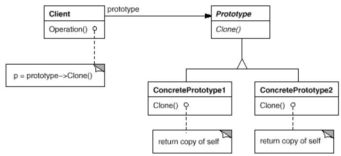

# Prototype

## Type: Creational Pattern

### Structure:

### In my Codes(Role - Classes):
- Client: `MazePrototypeFactory`
- Prototype: `Room`, `Maze`, etc..

### Key Word
- **CLONE**

### Key Point
- To implement `clone()` method! Use deep clone!

Java has its own `clone()` in `Object`, just override it.

