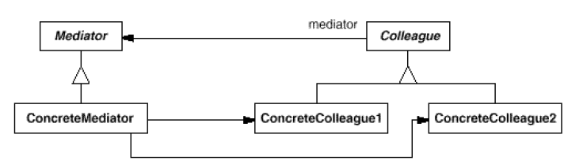
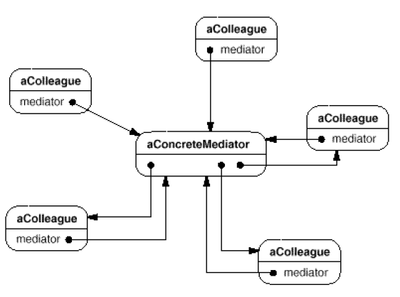

# Mediator

## Type: Behavioral Pattern

### Structure:

 

### In my Codes(Role - Classes):
- Mediator: `ChatRoom`
- Colleague: `User`
- If the structure is simple, the abstract class can be
 omitted

### Key Points
- A mediator defines an interface that is used for the 
 communication among colleagues, and manages these 
 colleagues
- A mediator abstracts the communication among colleagues
- A colleague contains a certain mediator, and to 
 communicate with others, just send a request to the
 mediator
- It limits subclassing, decouples colleagues, simplifies 
 the protocols, centralize the control, but it makes the 
 mediator complicated and hard to maintain