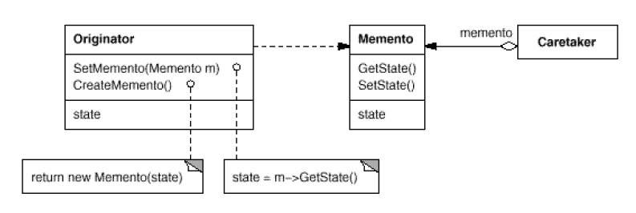
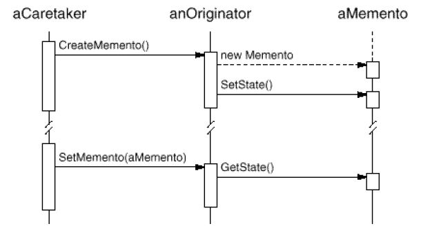

# Memento

## Type: Behavioral Pattern

### Structure:

### In my Codes(Role - Classes):
- Memento: `Memento`
- Originator: `Originator`
- Caretaker: `CareTaker`

### Key Points
- Memento stores the inner state of the originator (in the past), one copy
- Originator can create a memento object and recover from the memento object
- Caretaker stores the mementos using a list, but cannot check the mementos 
  (this can be done using friend-class in C++)
- Create a memento:
    1. Create a memento by originator
    2. Store the memento into the caretaker
- Recover from the memento
    1. Get the memento from the caretaker
    2. Recover fom the memento by originator
#### Collaboration Diagram
