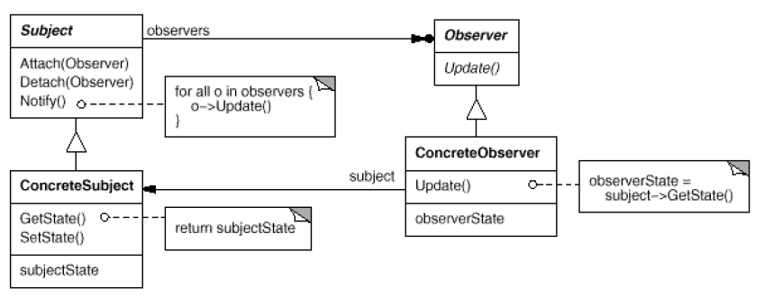
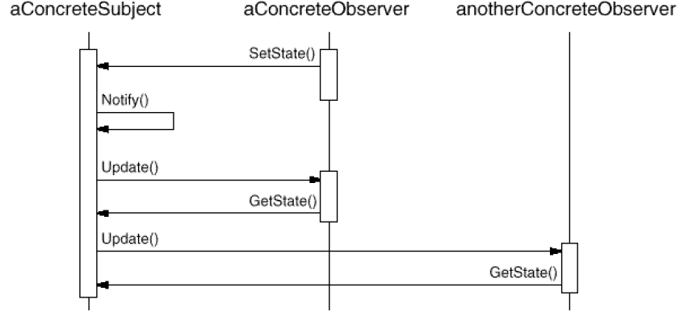

# Observer

## Type: Behavioral Pattern

### Structure:

### In my Codes(Role - Classes):
- Subject: `Subject`
- ConcreteSubject: `ClockTimer`
- Observer: `Observer`
- ConcreteObserver: `AnalogClock`, `DigitalClock`

### Key Points
- Subject:
    - It maintains the observer objects, that is there can
      be multiple observers observing one subject
    - When the states of the subject changed, it should 
      notify the observers which it contains
- Observer:
    - It maintains a reference to the subject
    - It saves the states of the subject
    - It should contain and implement the update interface 
      that make the states in the observer consistent with 
      the referenced subject
- If the update operations are complicated, we can use a 
  `ChangeManager` to do this, which uses the mediator pattern
- ChangeManager:
    - It offers an interface to maintain the mapping of subjects
     and observers (Register & Unregister)
    - It can define a specified strategy to update
- Order to use Observer Mode:
    1. Create a subject
    2. Create observers with a specified subject
    3. Execute `subject.notify()` to update the observers
    4. *Observers show the updated states to us
#### Collaboration Diagram

### MVC
- **M**odel: Subject
- **V**iew: Observer
- **C**ontrol: *ChangeManager