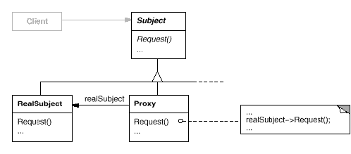
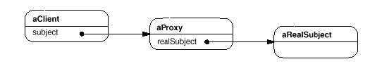

# Proxy

## Type: Structural Pattern

### Structure:

### In my Codes(Role - Classes):
- Subject: `Graphic` - Abstract Subject
- RealSubject: `Image`
- Proxy: `ImageProxy`

### Key Points
- A proxy contains a pointer/reference to the real subject instance, 
 which we can replace the real subject with proxy and the proxy can 
 control the real subject according to the definition of the interface
- Using a proxy to control a real subject can do more functionally
#### Runtime Diagram

### Types of Proxy
- Remote Proxy: provides a local representative for an object in a different
                address space
- Virtual Proxy: creates expensive objects on demand
- Protection Proxy: controls access to the original object.
- Smart Reference: a replacement for a bare pointer that performs
  additional actions when an object is accessed, for example:
  - Counting the number of references to the real object
  - Loading a persistent object into memory when it's first referenced
  - Checking that the real object is locked before it's accessed

#### Additional Contents
**Copy-on-Write**: Only the object is being changed,
 do we just copy the object, which can be implemented by 
 Proxy. It can save the cost especially on very big objects.
 (Making read-operation faster)
