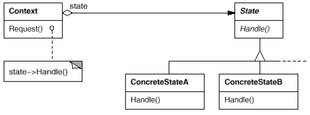

# State

## Type: Behavioral Pattern

### Structure:

### In my Codes(Role - Classes):
- Context: `TCPConnection` (with a state/states)
- State: `TCPState`
- ConcreteState： `TCPClosed`, `TCPListen`, `TCPEstablished`

### Key Point
- State:
    - Defines an interface for encapsulating the behavior associated with
    a particular state of the Context
    - Often it is a singleton
- Context:
    - Maintain a state object (Concrete State)
- ConcreteState:
    - Each subclass implements a behavior associated with a state of the
      Context
- Context's behavior is defined by the current state, the particular behavior
  is defined in the concrete state subclasses
- This mode can let us avoid writing large amount of conditioning clauses
- This mode is very similar to the design of FSM(Finite State Machine)