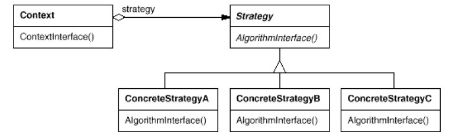

# Strategy

## Type: Behavioral Pattern

### Structure:

### In my Codes(Role - Classes):
- Context: `Context`
- Strategy: `Strategy`
- ConcreteStrategy: `AddStrategy`, `MinusStrategy`...

### Key Point
- Policy: Packaging a family of algorithms
- Strategy:
    It declares an interface common to all supported algorithms. 
    Context uses this interface to call the algorithm defined by a
    concrete strategy
- Concrete Strategy:
    It implements the algorithm using the Strategy interface
- Context:
    - It contains a reference to concrete strategy object
    - It can define an interface that allow the strategy to 
    get its data
- Hierarchies of Strategy classes define a family of algorithms 
  or behaviors for contexts to reuse
- But we should know what the strategy really does