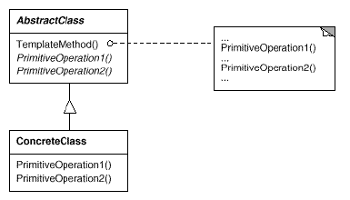

# Template Method

## Type: Behavioral Pattern

### Structure:

### In my Codes(Role - Classes):
- AbstractClass: `Game`
    - Template Method: `play()`
    - Primitive Operation: `initialize()`, `startPlay()`, `endPlay()`
- ConcreteClass: `FootballGame`, `CricketGame`

### Key Point
- A template method is defined in the abstract class, which uses some 
  abstract operations to define an algorithm. The subclasses redefine 
  these operations to make the template method different
- A template method implements the invariant parts of an algorithm once 
  and leave it up to subclasses to implement the behavior that can vary.
- Common behavior among subclasses should be factored and localized in
  a common class to avoid code duplication.