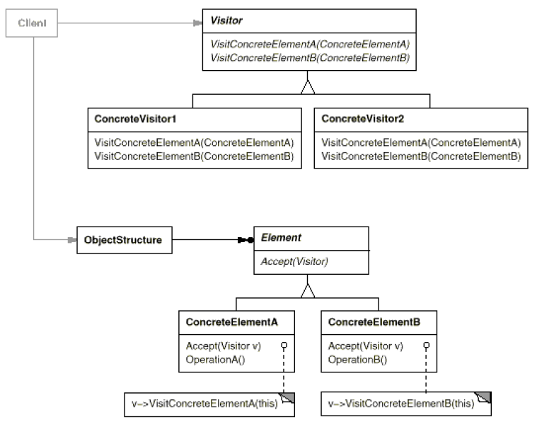
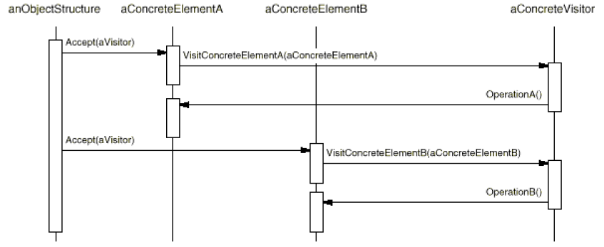

# Visitor

## Type: Behavioral Pattern

### Structure:

### In my Codes(Role - Classes):
- Visitor: `ComputerPartVisitor`
- ConcreteVisitor: `ComputerPartDisplayVisitor`
- Object Structure (Usually using Composite Mode)
    - Element: `ComputerPart`
    - ConcreteElement: `Mouse`, `Keyboard`...

### Key Point
- Visitor: Declare `visit()` for every concrete element in
 the object structure, **make the `ConcreteElement` the parameter**
 (using overloading)
- Concrete Visitor: Implement `visit()` and different visitors
 may have different `visit()` algorithms.
- Element: Declare `accept()`, **make the `Visitor` the parameter**
- Concrete Element: Implement `accept()`, there always exists 
  `visitor.visit(this)`
#### Collaboration Diagram

- Visitor can visit all the concrete elements, different visitors 
 may have different ways to visit elements 
- Visitor mode makes us easy to add new operations but hard to add 
 new elements and it may break encapsulation
- Visitor gathers related operations and separates unrelated ones
- Visitors can accumulate state as they visit each element
  in the object structure
